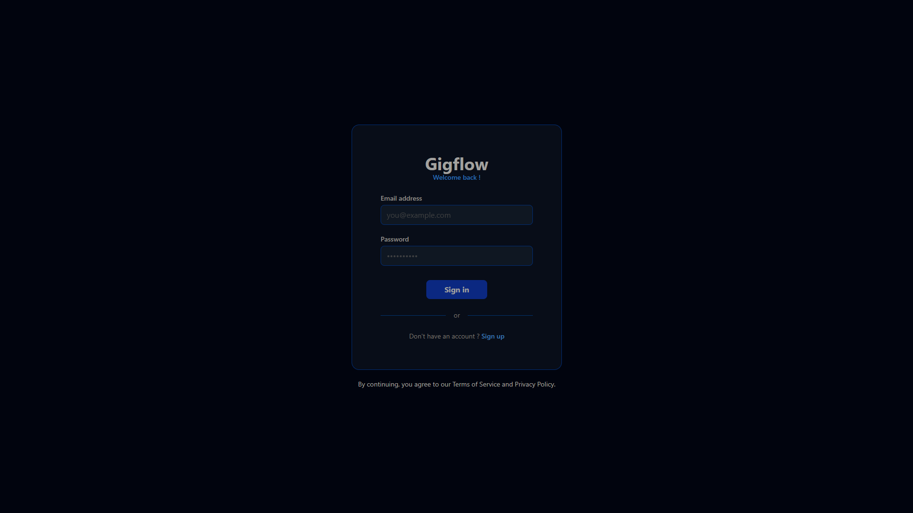
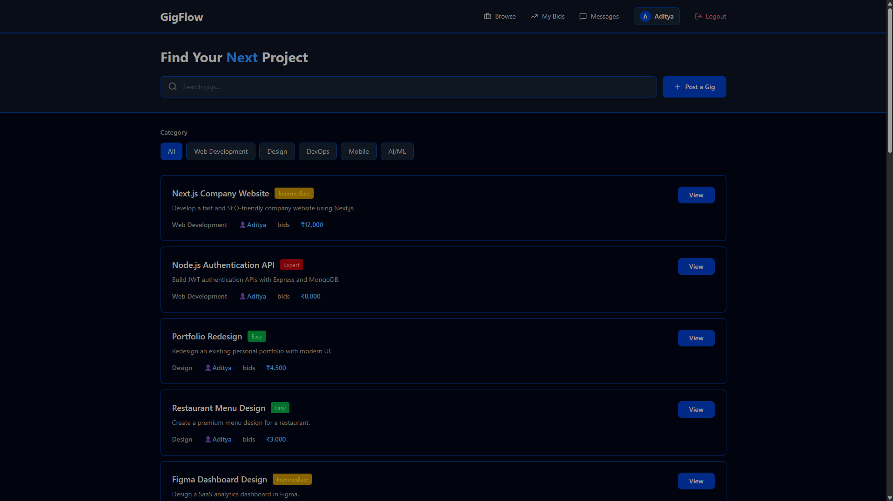
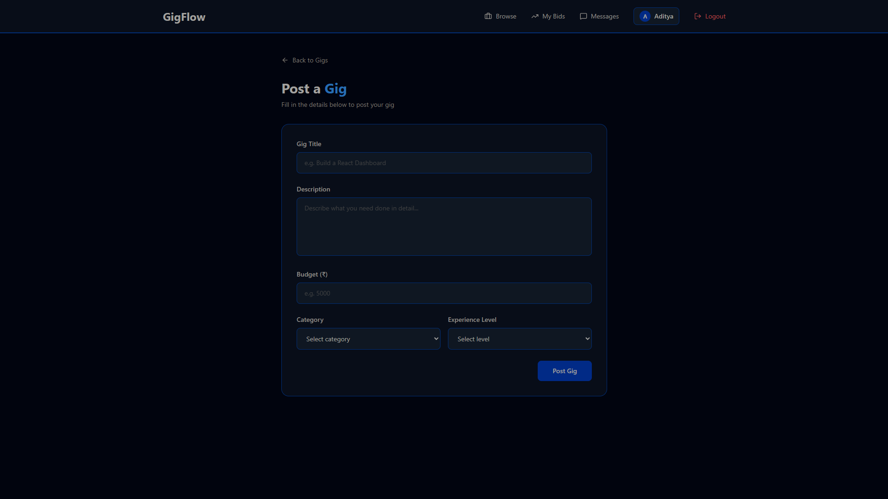
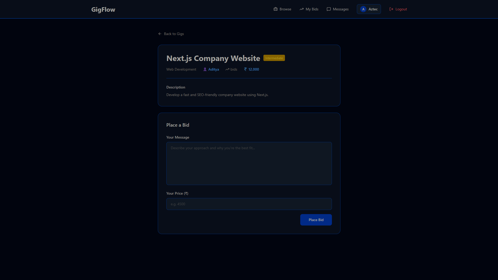
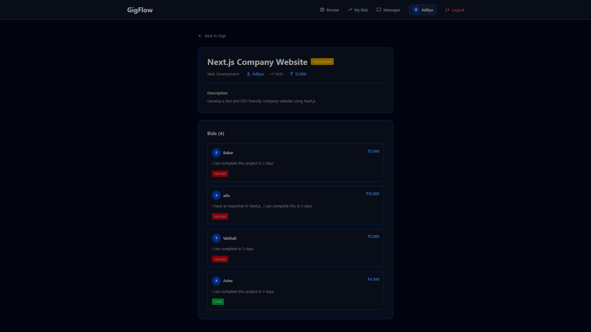
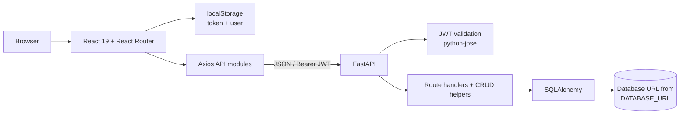
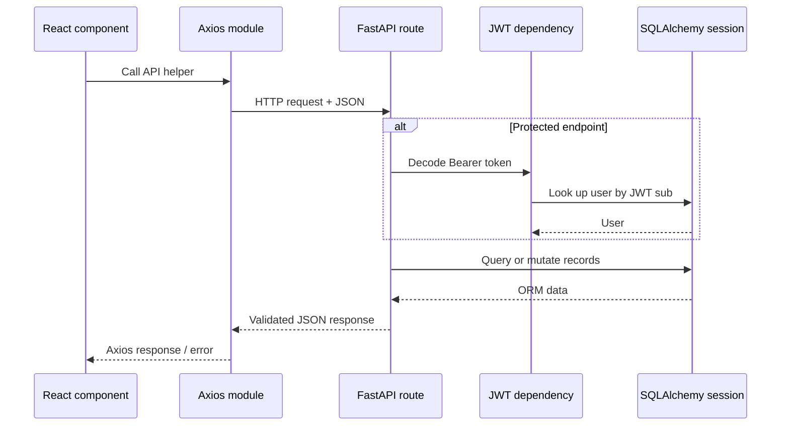
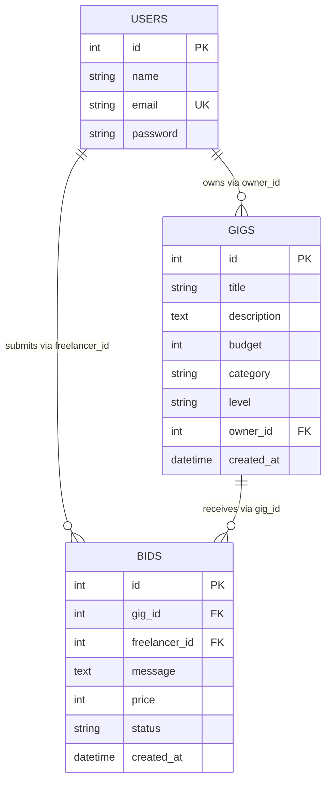
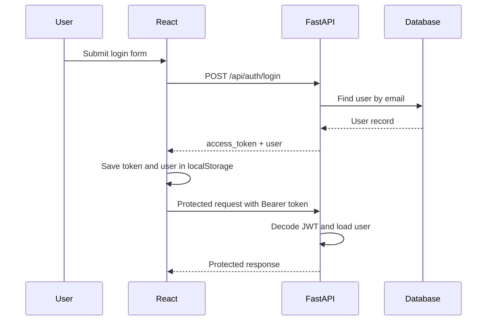
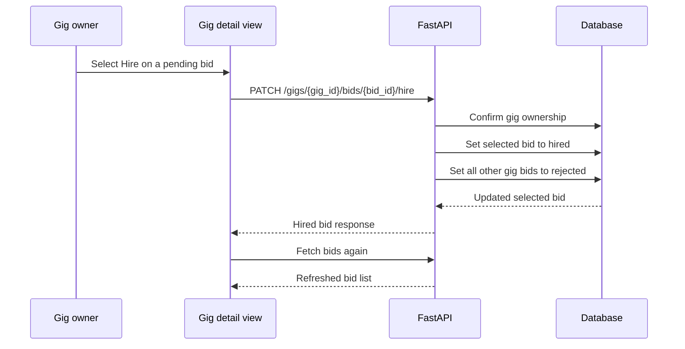

# GigFlow

> A compact full-stack marketplace where clients publish gigs and freelancers submit bids.

[](react-client)
[](fastapi-server)
[](https://www.sqlalchemy.org/)
[](https://jwt.io/)
[](https://axios-http.com/)
[](https://tailwindcss.com/)

GigFlow is a mini freelance marketplace built as a React single-page application and a FastAPI JSON API. It supports the core exchange between a client and a freelancer: users can register and sign in, create gigs, browse and filter them, place one bid per gig, and—when they own a gig—review bids and hire one bidder. Hiring a bidder marks every other bid on that gig as rejected.

The project is useful as a focused example of a React/FastAPI application with JWT-protected operations and SQLAlchemy persistence. It intentionally implements a small workflow rather than a full commercial marketplace.

## 🖼️ Preview

### Sign in



### Browse gigs



### Post a gig



### Place a bid



### Owner bid review



## Architecture at a Glance

```text
React
  │
Axios
  │
FastAPI
  │
SQLAlchemy
  │
Database
```

## Contents

- [Capabilities](#-capabilities)
- [Preview](#-preview)
- [Architecture at a Glance](#architecture-at-a-glance)
- [System Design](#-system-design)
- [Architecture Pattern](#-architecture-pattern)
- [Project layout](#-project-layout)
- [Database Design](#-database-design)
- [Authentication and authorization](#-authentication-and-authorization)
- [API reference](#-api-reference)
- [Frontend](#-frontend)
- [Backend](#-backend)
- [Validation and error handling](#-validation-and-error-handling)
- [Key Workflow](#-key-workflow)
- [What I Learned](#-what-i-learned)
- [Installation](#-installation)
- [Screenshots](#-screenshots)
- [Development notes](#-development-notes)
- [Future improvements](#-future-improvements)
- [Scaling considerations](#-scaling-considerations)
- [License](#-license)

## ✨ Capabilities

### Implemented

- Account registration with duplicate-email protection.
- Email/password login that returns a bearer JWT valid for 30 minutes.
- Gig creation by an authenticated user.
- Public gig listing and individual gig retrieval.
- Client-side title search and category filtering.
- Gig details with owner name, category, experience level, description, and budget.
- Authenticated bid creation with a message and price.
- Server-side protection against bidding on your own gig.
- Server-side protection against duplicate bids by the same user for the same gig.
- Gig-owner-only bid listing.
- Gig-owner-only hiring action.
- Hiring workflow that changes the selected bid to `hired` and all other bids on that gig to `rejected`.
- Loading, empty, success, and error states in the primary React flows.
- Browser-local persistence of the access token and signed-in user; logout clears both values.

### Present in the interface, but not implemented as workflows

The navigation visually includes **My Bids** and **Messages**, but those buttons do not navigate to a route or call an API. There is no messaging, profile, payment, review, notification, pagination, or file-upload implementation in this repository.

## 🧱 System Design

This diagram shows how the browser application, API, authentication, and persistence layers communicate.



| Layer | Responsibility | Repository location |
| --- | --- | --- |
| Client | Renders views, keeps UI state, stores session information, and makes HTTP calls. | `react-client/` |
| API | Exposes JSON endpoints, configures CORS, validates request shapes, and guards protected operations. | `fastapi-server/app/` |
| Domain persistence | Defines SQLAlchemy tables and query/mutation helpers. | `fastapi-server/app/models/`, `crud/` |
| Data store | Created through the `DATABASE_URL` supplied at runtime. The project does not prescribe a specific database vendor. | Runtime configuration |

## 🏗️ Architecture Pattern

The backend follows a **layered architecture**. Routes handle HTTP concerns and authorization, CRUD helpers perform persistence operations, SQLAlchemy models define the tables, and the database stores the data.

```text
FastAPI Route
  ↓
CRUD Helper
  ↓
SQLAlchemy Model
  ↓
Database
```

### Request lifecycle



## 🗂️ Project layout

```text
Gigflow/
├── fastapi-server/
│   ├── .env.example                 # Required runtime variable names
│   ├── requirements.txt             # Present but currently empty
│   └── app/
│       ├── main.py                  # FastAPI app, CORS, router registration
│       ├── database.py              # SQLAlchemy engine/session dependency
│       ├── auth.py                  # JWT creation settings
│       ├── models/
│       │   ├── user_model.py
│       │   ├── gig_model.py
│       │   └── bid_model.py
│       ├── schemas/
│       │   ├── user_schema.py
│       │   ├── gig_schema.py
│       │   └── bid_schema.py
│       ├── crud/
│       │   ├── user_crud.py
│       │   ├── gig_crud.py
│       │   └── bid_crud.py
│       └── routes/
│           ├── auth_routes.py
│           ├── gig_routes.py
│           └── bid_routes.py
├── react-client/
│   ├── package.json                 # Vite scripts and frontend dependencies
│   ├── vite.config.js
│   ├── tailwind.config.js
│   ├── postcss.config.js
│   ├── public/
│   └── src/
│       ├── main.jsx                 # React entry point
│       ├── App.jsx                  # BrowserRouter and route definitions
│       ├── api/                     # Axios wrappers: auth, gigs, bids
│       ├── components/              # Auth, list, post, detail views
│       ├── assets/
│       ├── index.css
│       └── App.css
├── API list.txt                     # Empty placeholder file
└── Gigflow(mini-freelance marketplace platform) (MID DIFFICULTY).pdf
```

The `Rough.jsx`, `rough.js`, and `rough.html` files are exploratory/demo artifacts. `Rough.jsx` is exposed at `/rough`; the other two are not imported by the application.

## 🧰 Technology stack

| Area | Technology | How it is used |
| --- | --- | --- |
| Frontend framework | React 19 | Function components, hooks, and rendering. |
| Routing | React Router DOM 7 | Browser routes for authentication, listing, posting, and gig details. |
| Build tooling | Vite 8 | Development server and production build. |
| HTTP client | Axios | Separate API modules for auth, gigs, and bids. |
| Styling | Tailwind CSS 4 / PostCSS | Utility classes used throughout the interface. |
| Icons | Lucide React | Navigation and interface icons. |
| API framework | FastAPI | Route declaration, request parsing, dependency injection, and OpenAPI support. |
| Validation / serialization | Pydantic | Request and response schemas. |
| Persistence | SQLAlchemy | Declarative table mapping and database sessions. |
| Authentication | python-jose | HS256 JWT encoding and decoding. |
| Configuration | python-dotenv | Loads `DATABASE_URL` and `SECRET_KEY` from `.env`. |

## 🗃️ Database Design

This entity-relationship diagram shows the database tables, their fields, and the foreign-key links between them.



The schema uses database foreign-key columns, but it does not declare SQLAlchemy `relationship()` properties. Names shown in API responses (`owner_name` and `freelancer_name`) are assembled by explicit user lookups in CRUD helpers.

### `users`

Represents an account that can own gigs and submit bids.

| Field | Type | Constraints / behavior |
| --- | --- | --- |
| `id` | integer | Primary key; indexed. |
| `name` | string | Indexed. |
| `email` | string | Unique; indexed. |
| `password` | string | Stored as submitted by the current implementation. |

Relationships expressed through foreign keys:

- One user can own many `gigs` through `gigs.owner_id`.
- One user can submit many `bids` through `bids.freelancer_id`.

### `gigs`

Represents a project request created by an authenticated account.

| Field | Type | Constraints / behavior |
| --- | --- | --- |
| `id` | integer | Primary key; indexed. |
| `title` | string | Required. |
| `description` | text | Required. |
| `budget` | integer | Required. No server-side positive-value rule exists. |
| `category` | string | Required. |
| `level` | string | Required. |
| `owner_id` | integer | Foreign key to `users.id`. |
| `created_at` | datetime | Defaults to `datetime.utcnow`. |

One gig belongs to one user and can receive many bids.

### `bids`

Represents one freelancer’s proposal for one gig.

| Field | Type | Constraints / behavior |
| --- | --- | --- |
| `id` | integer | Primary key; indexed. |
| `gig_id` | integer | Required foreign key to `gigs.id`. |
| `freelancer_id` | integer | Required foreign key to `users.id`. |
| `message` | text | Required; the route rejects whitespace-only values. |
| `price` | integer | Required; the route rejects values less than or equal to zero. |
| `status` | string | Defaults to `pending`; hiring changes values to `hired` or `rejected`. |
| `created_at` | datetime | Defaults to `datetime.utcnow`. |

One bid belongs to one gig and is authored by one user.

## 🔐 Authentication and authorization

GigFlow uses bearer tokens for protected gig and bid operations.

1. A user registers through `POST /api/auth/register`.
2. They sign in through `POST /api/auth/login` with email and password.
3. The API creates a HS256 JWT whose `sub` claim is the user ID and whose expiry is 30 minutes from issuance.
4. The React client stores `access_token` as `token` and the response’s user object as `user` in `localStorage`.
5. API wrappers attach `Authorization: Bearer <token>` to protected requests.
6. The FastAPI dependency decodes the token, reads `sub`, and confirms the referenced user still exists.



| Operation | Protection |
| --- | --- |
| Create gig | Any valid authenticated user. |
| Place bid | Any valid authenticated user who is not the gig owner and has not already bid on that gig. |
| List bids for a gig | The owner of that gig only. |
| Hire a bidder | The owner of that gig only. |
| List / view gigs | Public. |
| Register / login | Public. |

> **Security note:** Password comparison is currently plaintext and the password column receives the submitted value directly. This is a documented property of the present code, not a recommended production practice. Use a password hash (for example, bcrypt or Argon2) before deploying real user accounts. Tokens stored in `localStorage` also carry XSS exposure risk.

## 📚 API reference

The FastAPI app mounts its interactive OpenAPI interface at the framework default (`/docs`) when the server is running. The following reference reflects the route code.

### Common conventions

- Base URL used by the React client: `http://127.0.0.1:8000`
- Request and response bodies are JSON unless noted otherwise.
- Protected endpoints require `Authorization: Bearer <access_token>`.
- `created_at` values are serialized datetimes.

### Health / root

#### `GET /`

Returns a small backend status message. Authentication is not required.

```json
{ "message": "GigFlow Backend Running" }
```

### Authentication

#### `POST /api/auth/register`

Creates a user account. Authentication is not required.

| Request field | Type | Required |
| --- | --- | --- |
| `name` | string | Yes |
| `email` | string | Yes |
| `password` | string | Yes |

```bash
curl -X POST http://127.0.0.1:8000/api/auth/register \
  -H "Content-Type: application/json" \
  -d '{"name":"Asha","email":"asha@example.com","password":"example-password"}'
```

**Success — `200 OK`**

```json
{
  "message": "User created successfully",
  "user": { "id": 1, "name": "Asha", "email": "asha@example.com" }
}
```

**Possible errors:** `400` when the email is already registered; `422` when the JSON does not meet the schema.

#### `POST /api/auth/login`

Authenticates an existing user and issues a JWT. Authentication is not required.

| Request field | Type | Required |
| --- | --- | --- |
| `email` | string | Yes |
| `password` | string | Yes |

```bash
curl -X POST http://127.0.0.1:8000/api/auth/login \
  -H "Content-Type: application/json" \
  -d '{"email":"asha@example.com","password":"example-password"}'
```

**Success — `200 OK`**

```json
{
  "message": "User logged in successfully",
  "access_token": "<jwt>",
  "token_type": "bearer",
  "user": { "id": 1, "name": "Asha", "email": "asha@example.com" }
}
```

**Possible errors:** `401` with `"Invalid email or password"`; `422` for an invalid request body.

### Gigs

#### `GET /api/gigs/`

Returns every gig. Authentication is not required.

**Success — `200 OK`**

```json
[
  {
    "id": 8,
    "title": "Build a React dashboard",
    "description": "Create an internal reporting dashboard.",
    "budget": 5000,
    "category": "Web Development",
    "level": "Intermediate",
    "owner_id": 1,
    "owner_name": "Asha",
    "created_at": "2026-07-25T10:00:00"
  }
]
```

#### `GET /api/gigs/{gig_id}`

Returns a gig by ID. Authentication is not required. (The frontend requests a trailing slash; FastAPI may redirect that form to this route.)

**Success — `200 OK`:** one object with the same shape as an item in the listing response.

**Possible errors:** `404` with `"Gig not found"`.

#### `POST /api/gigs/`

Creates a gig under the authenticated user’s ID.

| Request field | Type | Required |
| --- | --- | --- |
| `title` | string | Yes |
| `description` | string | Yes |
| `budget` | integer | Yes |
| `category` | string | Yes |
| `level` | string | Yes |

```bash
curl -X POST http://127.0.0.1:8000/api/gigs/ \
  -H "Authorization: Bearer <jwt>" \
  -H "Content-Type: application/json" \
  -d '{"title":"Build a React dashboard","description":"Create an internal reporting dashboard.","budget":5000,"category":"Web Development","level":"Intermediate"}'
```

**Success — `200 OK`:** a gig object, including generated `id`, `owner_id`, `owner_name`, and `created_at`.

**Possible errors:** `401` for a missing, invalid, expired, or userless token; `422` for a request that does not satisfy the Pydantic schema.

### Bids

#### `POST /api/gigs/{gig_id}/bids`

Creates a bid as the authenticated user.

| Request field | Type | Required |
| --- | --- | --- |
| `message` | string | Yes |
| `price` | integer | Yes |

```bash
curl -X POST http://127.0.0.1:8000/api/gigs/8/bids \
  -H "Authorization: Bearer <jwt>" \
  -H "Content-Type: application/json" \
  -d '{"message":"I can deliver the dashboard this week.","price":4500}'
```

**Success — `200 OK`**

```json
{
  "id": 14,
  "gig_id": 8,
  "freelancer_id": 2,
  "freelancer_name": "Ravi",
  "message": "I can deliver the dashboard this week.",
  "price": 4500,
  "status": "pending",
  "created_at": "2026-07-25T10:15:00"
}
```

**Possible errors:** `400` for non-positive price, blank message, bidding on one’s own gig, or an existing bid by the same user; `404` if the gig is missing; `401` if authentication fails; `422` for schema-invalid input.

#### `GET /api/gigs/{gig_id}/bids`

Returns every bid for one gig. Only that gig’s owner may call it.

**Success — `200 OK`:** an array of bid objects in the shape above.

**Possible errors:** `401` for authentication failure; `403` with `"You are not allowed to view these bids."`; `404` if the gig is missing.

#### `PATCH /api/gigs/{gig_id}/bids/{bid_id}/hire`

Hires one bid and rejects all other bids for the same gig. Only the gig owner may call it. No request body is expected; the React API helper sends `{}`.

```bash
curl -X PATCH http://127.0.0.1:8000/api/gigs/8/bids/14/hire \
  -H "Authorization: Bearer <jwt>" \
  -H "Content-Type: application/json" \
  -d '{}'
```

**Success — `200 OK`:** the selected bid object with `"status": "hired"`.

**Possible errors:** `401` for authentication failure; `403` with `"You are not allowed to hire for this gig."`; `404` for a missing gig or for a bid that does not belong to the given gig.

### Hiring workflow



## 🖥️ Frontend

### Routes

| Path | Component | Purpose |
| --- | --- | --- |
| `/auth` | `AuthPage` | Sign in and account creation form. |
| `/main` | `MainPage` | Fetches, searches, filters, and displays gigs. |
| `/post-gig` | `PostGigPage` | Authenticated gig-creation form. |
| `/gigs/:gigId` | `GigPage` | Gig details, bid form, owner-only bid list, and hire action. |
| `/rough` | `Rough` | Exploratory gig-details screen. |

There is no catch-all route or route guard. A page may render even if no session is stored; protected API calls are ultimately enforced by the server.

### Component responsibilities

| Component | Local state and behavior |
| --- | --- |
| `AuthPage` | Toggles sign-in/create-account modes, checks matching client-side confirmation passwords before registration, and persists successful login data. |
| `MainPage` | Retrieves gigs once on mount, filters them in memory by title and selected category, and displays loading/empty states. |
| `PostGigPage` | Tracks form fields, performs a client-side required-fields check, posts the gig with the stored token, and navigates back to `/main`. |
| `GigPage` | Fetches the gig, conditionally fetches bids for its owner, conditionally renders a bid form for non-owners, and refreshes bids after hiring. |

The client uses local component state (`useState` / `useEffect`); there is no external state-management library. Axios instances are created separately in `src/api/auth.js`, `gigs.js`, and `bids.js`, each targeting `http://127.0.0.1:8000`.

## ⚙️ Backend

### Design

- `main.py` creates tables with `Base.metadata.create_all(bind=engine)`, configures CORS for `http://localhost:5173`, and mounts route groups.
- Pydantic schemas define the expected external fields and response shapes.
- Route modules contain endpoint-specific validation and authorization checks.
- CRUD modules execute the database queries and return dictionaries shaped for response schemas.
- `database.py` loads `DATABASE_URL`, creates an SQLAlchemy engine, and provides a session dependency that closes each session after use.
- `auth.py` loads `SECRET_KEY` and signs 30-minute HS256 access tokens.

### CORS

The backend allows credentialed cross-origin requests only from `http://localhost:5173`, with all HTTP methods and headers permitted. The React Axios modules use `http://127.0.0.1:8000` as the API origin; this is same-origin from the API’s perspective rather than a browser origin to whitelist. If the frontend is served from an origin other than the configured one, update `allow_origins` deliberately.

## ✅ Validation and error handling

### Enforced on the server

| Rule | Endpoint / layer | Failure |
| --- | --- | --- |
| Email must be unique. | Registration CRUD helper | `400` |
| Login email and password must match an existing account. | Login route | `401` |
| Bearer token must decode, contain `sub`, and reference an existing user. | Protected route dependency | `401` |
| Bid price must be greater than zero. | Create-bid route | `400` |
| Bid message cannot be empty after trimming whitespace. | Create-bid route | `400` |
| Gig must exist before bidding, listing bids, or hiring. | Bid routes | `404` |
| A user cannot bid on their own gig. | Create-bid route | `400` |
| A user may only submit one bid per gig. | Create-bid route | `400` |
| Only a gig owner may list its bids or hire a bid. | Bid routes | `403` |
| The selected bid must belong to the supplied gig to be hired. | CRUD hire lookup | `404` |

Pydantic additionally returns FastAPI’s standard `422 Unprocessable Entity` response when a request body cannot be parsed into its schema. The frontend performs a smaller set of convenience checks—required gig/bid fields and matching registration passwords—and displays API error messages where available.

### Status codes used explicitly

| Status | Meaning in this project |
| --- | --- |
| `200` | Successful reads and mutations. |
| `400` | Duplicate email or invalid bid business rule. |
| `401` | Invalid credentials or invalid/missing/expired JWT session. |
| `403` | Authenticated user is not the gig owner for an owner-only action. |
| `404` | Requested gig or bid does not exist in the relevant scope. |
| `422` | FastAPI/Pydantic request validation failure. |

## 🔄 Key Workflow

The main marketplace lifecycle is:

```text
User registers
  │
  ▼
User logs in
  │
  ▼
Client creates a gig
  │
  ▼
Another user submits a bid
  │
  ▼
Gig owner reviews bids
  │
  ▼
Gig owner hires one bidder
  │
  ▼
Selected bid is hired; all other bids are rejected
```

## 🎓 What I Learned

- Building REST APIs with FastAPI and Pydantic schemas.
- Implementing JWT-based authentication and protected API endpoints.
- Modeling users, gigs, and bids with SQLAlchemy foreign keys.
- Structuring backend code with routes, CRUD helpers, models, and schemas.
- Building React views with hooks and client-side state.
- Connecting a React frontend to a REST API with Axios.
- Using React Router for page-level navigation.
- Enforcing ownership and marketplace business rules on the server.

## 🚀 Installation

### Prerequisites

- Python 3.10+ is recommended for the FastAPI application.
- Node.js and npm are required for the Vite frontend.
- A database connection URL supported by SQLAlchemy.

### 1. Clone the repository

```bash
git clone <repository-url>
cd Gigflow
```

### 2. Configure and run the backend

Create and activate a virtual environment:

```bash
cd fastapi-server
python -m venv venv
```

**Windows PowerShell**

```powershell
.\venv\Scripts\Activate.ps1
```

**macOS/Linux**

```bash
source venv/bin/activate
```

The repository’s `fastapi-server/requirements.txt` currently contains no dependency entries. Install the packages required by the imports explicitly:

```bash
pip install fastapi "uvicorn[standard]" sqlalchemy python-dotenv "python-jose[cryptography]"
```

Create `fastapi-server/.env` from the supplied example:

```bash
cp .env.example .env
```

On Windows PowerShell, use:

```powershell
Copy-Item .env.example .env
```

Set these variables:

```dotenv
DATABASE_URL=<your SQLAlchemy database URL>
SECRET_KEY=<a long, random signing secret>
```

`DATABASE_URL` is passed directly to `sqlalchemy.create_engine`. For a local SQLite development database, an example value is:

```dotenv
DATABASE_URL=sqlite:///./gigflow.db
```

Start the API from `fastapi-server/`:

```bash
uvicorn app.main:app --reload
```

The API will listen on `http://127.0.0.1:8000`. On startup, the application calls `Base.metadata.create_all`, which creates the defined tables if they are missing.

### 3. Run the frontend

In a second terminal:

```bash
cd react-client
npm install
npm run dev
```

Vite normally serves the client at `http://localhost:5173`, which matches the backend’s configured CORS allowlist. Open the displayed URL and begin at `/auth`.

### Available frontend scripts

| Command | Purpose |
| --- | --- |
| `npm run dev` | Start the Vite development server. |
| `npm run build` | Build production assets. |
| `npm run preview` | Preview the production build locally. |
| `npm run lint` | Run ESLint across the frontend. |

## 🖼️ Screenshots

The preview images are committed under [`docs/screenshots/`](docs/screenshots/). They show the sign-in screen, gig browsing, gig creation, bid placement, and the gig-owner view for reviewing and hiring bids.

## 🛠️ Development notes

- The frontend currently has no automated test suite configured.
- The backend has no test suite, migration configuration, or dependency pins in `requirements.txt` in the present repository.
- The Gig response schema has no `bids` field, although a few UI labels attempt to render `gig.bids`; the API does not currently return that count.
- Gig listing and detail lookup their owner records individually in CRUD helpers. This is simple for a small data set but can create additional queries as the listing grows.
- `Base.metadata.create_all` is suitable for initial local table creation but does not replace schema migrations for evolving production databases.

## 🔮 Future improvements

The existing entities and flows provide natural extension points for:

- Password hashing, stronger secret management, and refresh/session-expiry UX.
- A user profile page and a real **My Bids** view derived from `Bid.freelancer_id`.
- Pagination, server-side search, sort, and category filtering for gig discovery.
- A bid-count field or aggregate endpoint to align list/detail displays with the API.
- Explicit SQLAlchemy relationships and query optimization for owners and bids.
- Database migrations and a populated, version-pinned backend dependency manifest.
- Automated API, authorization, and frontend component/end-to-end tests.
- Messaging, notifications, reviews, and attachments as distinct domain models and routes.
- Payments only after introducing the appropriate order/escrow, audit, and security model.
- Deployment configuration, environment-specific CORS, structured logging, and error monitoring.

## 📈 Scaling considerations

The present design is direct and appropriate for a small deployment: one FastAPI process uses SQLAlchemy sessions to read and write a database, and one React bundle calls the API. Growth would make a few changes especially valuable:

| Concern | Current behavior | Scale-oriented direction |
| --- | --- | --- |
| Gig discovery | Loads all gigs and filters in the browser. | Add indexed server-side filtering, pagination, and ordering. |
| Owner names / bid names | Extra user lookup per result in CRUD loops. | Use joins or eager loading and serialize efficiently. |
| Hiring correctness | Updates selected and remaining bids in one request flow. | Keep it transactional and consider a gig-level closed/hired state to prevent later bids. |
| Read pressure | Every request reaches the primary database. | Cache popular public gig listings with deliberate invalidation. |
| Long-running work | No asynchronous workloads exist. | Introduce a worker/queue only when notifications, media processing, or similar tasks are added. |
| Deployment | Local origins and single-process development defaults. | Use managed secrets, a production ASGI deployment, connection pooling, HTTPS, monitoring, and explicit CORS origins. |

## 📄 License

No license file is currently included. If this project is intended for open-source reuse, add an MIT `LICENSE` file and replace this section with the license text or a link.

## 👤 Author

Replace these placeholders with project ownership details:

- GitHub: [Aztec331](https://github.com/Aztec331)
- LinkedIn: [Aditya Babar](https://www.linkedin.com/in/aditya-babar-7604141a3/)
- Portfolio: `https://<your-domain>/`
